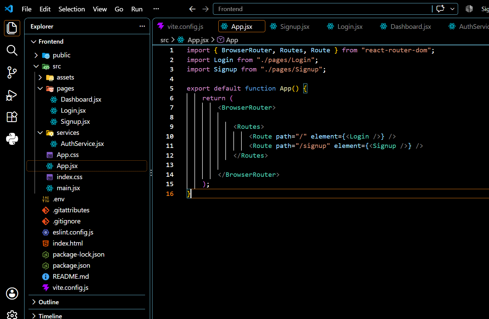
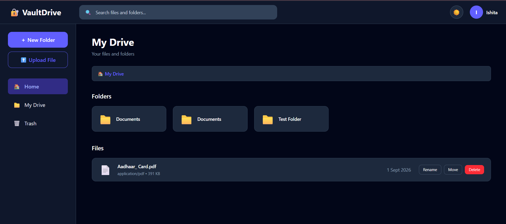

# 🔐 VaultDrive

<p align="center">
  <strong>A modern full-stack file management system for secure cloud file storage and organization.</strong>
</p>

<p align="center">
  Upload • Organize • Search • Share • Manage
</p>

---

## 🚀 About VaultDrive

**VaultDrive** is a full-stack file management system that allows users to securely upload, manage, organize, search, share, and access their files through a modern and responsive web interface.

The application combines a **React frontend**, **Node.js/Express backend**, **PostgreSQL database**, and **Supabase cloud storage** to provide a complete file management experience.

---

## ✨ Features

### 🔐 Authentication

- User registration and login
- JWT-based authentication
- Password hashing using bcrypt
- Protected backend routes
- Authentication middleware
- Google OAuth authentication using Supabase Auth

### 📁 File Management

- Secure file upload
- File rename
- File update
- File download
- File deletion
- File preview
- Image thumbnails
- Upload progress indicator
- Secure cloud storage using Supabase Storage

### 📂 Folder Organization

- Create folders
- Open folders
- Folder hierarchy
- Folder navigation
- Organize files inside folders

### 🔎 Search & Discovery

- PostgreSQL full-text search
- Real-time search
- Debounced search
- Search result handling
- Recent files
- Sorting by:
  - Name
  - Size
  - Date

### 📄 Pagination & Performance

- Client-side file pagination
- Numbered pagination controls
- Lazy loading of image thumbnails
- Debounced search requests
- Optimized dashboard rendering

### 🔗 Sharing & Permissions

- Generate secure shareable links
- Role-based file permissions
- Permission-based file access
- Signed URLs for protected file access

### 🗑️ Trash Management

- Soft-delete files
- View deleted files
- Restore deleted files

### 🎨 Modern UI

- Responsive dashboard
- Grid and list file views
- Responsive mobile navigation
- Light mode
- Dark mode
- Toast notifications
- Loading states
- Error handling
- Profile menu
- Logout functionality

---

## 🛠️ Tech Stack

| Category | Technologies |
|----------|--------------|
| 🎨 Frontend | React.js, Vite, JavaScript, Tailwind CSS, Axios |
| ⚙️ Backend | Node.js, Express.js |
| 🗄️ Database | PostgreSQL |
| 🔐 Authentication | JWT, bcrypt, Supabase Auth |
| ☁️ Storage | Supabase Storage |
| 🧪 Testing | Jest, Supertest, Postman |
| 🚀 Frontend Deployment | Vercel |
| 🌐 Backend Deployment | Render |

---

## 🏗️ Application Architecture

```text
                         ┌──────────────────────┐
                         │      VaultDrive      │
                         │      Frontend        │
                         │   React + Vite       │
                         └──────────┬───────────┘
                                    │
                                    │ REST API
                                    ▼
                         ┌──────────────────────┐
                         │       Backend        │
                         │  Node.js + Express   │
                         │  JWT Authentication  │
                         └──────────┬───────────┘
                                    │
                     ┌──────────────┴──────────────┐
                     ▼                             ▼
          ┌────────────────────┐       ┌────────────────────┐
          │    PostgreSQL      │       │  Supabase Storage  │
          │      Database      │       │    File Storage    │
          └────────────────────┘       └────────────────────┘
```

---

## 📁 Project Structure

### 🎨 Frontend

```text
VaultDrive-Frontend/
│
├── public/
│
├── src/
│   ├── components/
│   │
│   ├── lib/
│   │   └── supabase.js
│   │
│   ├── pages/
│   │   ├── Dashboard.jsx
│   │   └── Login.jsx
│   │
│   ├── services/
│   │   ├── AuthService.js
│   │   └── DriveService.js
│   │
│   └── ...
│
├── .env
├── package.json
└── README.md
```

### ⚙️ Backend

```text
VaultDrive-Backend/
│
├── controllers/
├── middleware/
├── routes/
├── tests/
│
├── db.js
├── index.js
├── package.json
└── ...
```

---

## 🔐 Authentication

VaultDrive supports multiple authentication mechanisms.

### 📧 Email & Password

Users can register and log in using their email address and password.

Passwords are securely hashed using **bcrypt** before being stored.

### 🎫 JWT Authentication

After successful authentication, the application generates a JWT token.

The token is used to access protected backend APIs.

### 🔵 Google OAuth

Google authentication is integrated using **Supabase Auth**.

This allows users to authenticate using their Google account.

---

## 📂 File Management

VaultDrive provides a centralized dashboard for managing uploaded files.

### Supported Operations

| Operation | Supported |
|-----------|-----------|
| 📤 Upload | ✅ |
| 👁️ Preview | ✅ |
| 📥 Download | ✅ |
| ✏️ Rename | ✅ |
| 🔄 Update | ✅ |
| 🗑️ Delete | ✅ |
| 🔎 Search | ✅ |
| 📂 Organize | ✅ |

Files are stored securely in **Supabase Storage**, while file metadata is maintained in **PostgreSQL**.

---

## 📁 Folder Management

VaultDrive provides hierarchical folder organization.

### Users Can

- 📂 Create folders
- 📂 Open folders
- ↔️ Navigate through folder hierarchy
- 🗂️ Organize files inside folders
- 🔄 Navigate between parent and child folders

---

## 🔗 File Sharing & Permissions

VaultDrive supports secure file sharing through shareable links and permission-based access.

### Sharing Features

- 🔗 Generate shareable links
- 👤 Assign file permissions
- 🔐 Role-based access
- 🛡️ Protected shared-file access
- 🔑 Signed URLs for secure file access

---

## 🔎 Search & Optimization

VaultDrive uses **PostgreSQL full-text search** for efficient file discovery.

### Search Features

- 🔍 Real-time search
- ⚡ Debounced search
- 🗄️ PostgreSQL full-text search
- 📄 Search result pagination
- ↕️ Sorting by name, size, and date
- 🕒 Recent file filtering

### ⚡ Performance Features

- Client-side pagination
- Lazy loading of image thumbnails
- Debounced API requests
- Optimized dashboard rendering

---

## 🗑️ Trash Management

VaultDrive uses **soft deletion** to move deleted files into Trash instead of immediately removing them.

### Trash Features

- 🗑️ View deleted files
- ♻️ Restore deleted files
- 🔐 Preserve deleted file metadata

---

## 🎨 Responsive Design

VaultDrive is designed to work across desktop, tablet, and mobile screen sizes.

### 📱 Responsive Features

- Responsive sidebar
- Mobile navigation drawer
- Responsive file cards
- Responsive search controls
- Responsive sorting controls
- Mobile-friendly pagination
- Adaptive dashboard layout

---

## 🌗 Theme Support

VaultDrive supports both major interface themes.

| Theme | Status |
|-------|--------|
| ☀️ Light Mode | ✅ |
| 🌙 Dark Mode | ✅ |

The selected theme is persisted locally so that the user's preference is maintained.

---

## 🔔 Notifications & Error Handling

VaultDrive provides user-friendly feedback through toast notifications and error states.

### Handles

- ❌ Authentication failures
- ❌ File upload failures
- ❌ File operation failures
- ❌ Search failures
- ❌ Trash operation failures
- ❌ Network/API errors
- ⏳ Loading states
- 📊 Upload progress

---

# 📅 Development Progress

VaultDrive was developed incrementally through a **14-day implementation cycle**.

Each development phase focused on a specific part of the application, followed by testing and verification.

---

## 📅 Day 1 — Project Setup

### 🎯 Focus

Backend initialization and database connectivity.

### ✅ Implemented

- Initialized VaultDrive backend
- Set up Node.js and Express
- Connected PostgreSQL using Supabase
- Configured environment variables
- Established database connectivity
- Created initial backend project structure

### 📸 Evidence


---

## 📅 Day 2 — Authentication

### 🎯 Focus

Secure user authentication.

### ✅ Implemented

- User registration
- User login
- Password hashing using bcrypt
- JWT-based authentication
- Authentication middleware
- Protected API routes
- Google OAuth authentication using Supabase Auth

### 📸 Evidence


---

## 📅 Day 3 — File Upload & Storage

### 🎯 Focus

Secure file uploading and cloud storage.

### ✅ Implemented

- File upload API
- Multer middleware
- File size validation
- Supabase Storage integration
- Secure storage paths
- User-specific file storage
- File upload testing using Postman

### 📸 Evidence


---

## 📅 Day 4 — File Management APIs

### 🎯 Focus

File and folder management.

### ✅ Implemented

- File CRUD operations
- File rename functionality
- File update functionality
- Folder creation
- Folder hierarchy
- Soft deletion
- Trash APIs
- Folder management APIs

### 📸 Evidence


---

## 📅 Day 5 — Sharing & Permissions

### 🎯 Focus

Secure file sharing and access control.

### ✅ Implemented

- Shareable file links
- Role-based permissions
- Permission-based file access
- Secure shared file access
- Signed URLs
- Sharing API testing
- Permission API testing

### 📸 Evidence


---

## 📅 Day 6 — Search & Optimization

### 🎯 Focus

Efficient file discovery and API optimization.

### ✅ Implemented

- PostgreSQL full-text search
- File search API
- Search result pagination
- File retrieval pagination
- Sorting functionality
- Optimized file retrieval queries

### 📸 Evidence


---

## 📅 Day 7 — Testing & Backend Deployment

### 🎯 Focus

Backend testing and production deployment.

### ✅ Implemented

- API testing using Postman
- Jest test setup
- Supertest API testing
- Authentication API testing
- File management API testing
- Folder API testing
- Sharing and permission API testing
- Search and pagination API testing
- Backend deployment using Render

### 📸 Evidence


---

## 📅 Day 8 — Frontend Setup

### 🎯 Focus

React frontend initialization.

### ✅ Implemented

- Created React frontend using Vite
- Configured Tailwind CSS
- Added Axios
- Configured Supabase client
- Connected frontend with backend APIs
- Created login interface
- Created initial dashboard structure
- Configured frontend environment variables

### 📸 Evidence



---

## 📅 Day 9 — Dashboard UI

### 🎯 Focus

Building the main VaultDrive user interface.

### ✅ Implemented

- VaultDrive dashboard
- Sidebar navigation
- File and folder display
- File cards and previews
- Search interface
- Sorting controls
- Recent files section
- Account section
- Light and dark mode
- Responsive dashboard components

### 📸 Evidence



---

## 📅 Day 10 — File Upload Management

### 🎯 Focus

Connecting the dashboard with file management APIs.

### ✅ Implemented

- Frontend file upload
- File upload interface
- File upload API integration
- File rename
- File update
- File download
- File deletion
- File operation feedback
- Upload progress indicator

### 📸 Evidence


---

## 📅 Day 11 — File Organization & Dashboard Features

### 🎯 Focus

Improving file organization and dashboard functionality.

### ✅ Implemented

- Folder navigation
- Folder hierarchy
- Folder creation
- Recent files
- Account section
- Responsive navigation
- Improved dashboard interactions

### 📸 Evidence


---

## 📅 Day 12 — Search Optimization & Pagination

### 🎯 Focus

Improving search, sorting, pagination, and dashboard performance.

### ✅ Implemented

- Frontend search integration
- PostgreSQL full-text search integration
- Debounced search
- Search result handling
- Client-side pagination
- Numbered pagination controls
- Sorting by name
- Sorting by size
- Sorting by date
- Lazy loading of image thumbnails
- Improved pagination UI
- Improved dashboard responsiveness

### 📸 Evidence


---

## 📅 Day 13 — Trash, Versioning & Final Testing

### 🎯 Focus

Completing file lifecycle management and version tracking.

### 🔄 Planned / In Progress

- Trash management improvements
- File restoration
- Permanent deletion
- File versioning
- Version history
- Version metadata tracking
- Final backend testing

> 🚧 **Status:** Final implementation and verification phase.

---

## 📅 Day 14 — Deployment & Final Touches

### 🎯 Focus

Production deployment, responsiveness, and final verification.

### 🔄 Planned

- Frontend deployment using Vercel
- Production environment configuration
- Mobile responsiveness improvements
- Final UI fixes
- Performance improvements
- End-to-end testing
- Final deployment verification

---

# 🧪 Testing & Verification

VaultDrive was tested throughout development using both automated and manual testing.

### 🧰 Testing Tools

| Tool | Purpose |
|------|---------|
| 🧪 Jest | Backend unit testing |
| 🔌 Supertest | API testing |
| 📮 Postman | Manual API testing |

### ✅ Automated Test Result

```text
Test Suites: 7 passed, 7 total
Tests:       10 passed, 10 total
```

All currently implemented backend test suites are passing successfully.

---

# ⚙️ Environment Variables

Create a `.env` file in the frontend root directory:

```env
VITE_API_URL=your_backend_url
VITE_SUPABASE_URL=your_supabase_url
VITE_SUPABASE_ANON_KEY=your_supabase_publishable_key
```

> ⚠️ **Important:** Never commit `.env` files, API keys, service-role keys, or other secrets to GitHub.

---

# 🚀 Getting Started

## 1️⃣ Clone the Repositories

```bash
git clone <backend-repository-url>
git clone <frontend-repository-url>
```

---

## 2️⃣ Start the Backend

```bash
cd VaultDrive-Backend
npm install
npm run dev
```

---

## 3️⃣ Start the Frontend

```bash
cd VaultDrive-Frontend
npm install
npm run dev
```

The frontend connects to the backend through the `VITE_API_URL` environment variable.

---

# ☁️ Deployment

| Component | Platform |
|-----------|----------|
| 🎨 Frontend | Vercel |
| ⚙️ Backend | Render |
| 🗄️ Database | Supabase PostgreSQL |
| 📦 File Storage | Supabase Storage |

---

# 🔒 Security

VaultDrive uses multiple security mechanisms to protect user data and file access.

### Security Measures

- 🔐 JWT authentication
- 🔑 bcrypt password hashing
- 🛡️ Protected API routes
- 👤 User-specific file access
- 👥 Role-based permissions
- 🔗 Secure shareable links
- 🔏 Signed URLs
- 🌐 Environment-based secret configuration
- ☁️ Supabase Storage

---

# 📊 Project Status

| Module | Status |
|--------|:------:|
| 🔐 Authentication | ✅ |
| 📤 File Upload | ✅ |
| 📁 File Management | ✅ |
| 📂 Folder Management | ✅ |
| 🔗 Sharing & Permissions | ✅ |
| 🔎 Search | ✅ |
| ↕️ Sorting | ✅ |
| 📄 Pagination | ✅ |
| 🖼️ Lazy Loading | ✅ |
| 🎨 Dashboard UI | ✅ |
| 🌗 Theme Support | ✅ |
| 📱 Responsive UI | 🔄 |
| 🗑️ Trash | 🔄 Final Verification |
| 🕐 File Versioning | 🔄 |
| 🚀 Frontend Deployment | 🔄 Final Verification |

---

# 🗺️ Roadmap

### ✅ Completed

- [x] Backend setup
- [x] Database integration
- [x] Authentication
- [x] Google OAuth
- [x] File upload
- [x] File management
- [x] Folder organization
- [x] Sharing & permissions
- [x] Search
- [x] Sorting
- [x] Pagination
- [x] Lazy loading
- [x] Dashboard UI
- [x] Dark / Light mode
- [x] Backend deployment

### 🚧 Final Phase

- [ ] Complete trash verification
- [ ] Implement file versioning
- [ ] Complete final testing
- [ ] Final mobile responsiveness
- [ ] Frontend production deployment
- [ ] End-to-end verification

---

# 👩‍💻 Author

## Ishita Verma

**B.Tech Computer Science Engineering — GNDU '26**

Full Stack Developer | React | Node.js | Express | PostgreSQL

---

<p align="center">
  <strong>🔐 VaultDrive</strong>
</p>

<p align="center">
  Secure your files. Organize your workspace. Access everything from one place.
</p>

<p align="center">
  ⭐ Built with React, Node.js, PostgreSQL & Supabase
</p>